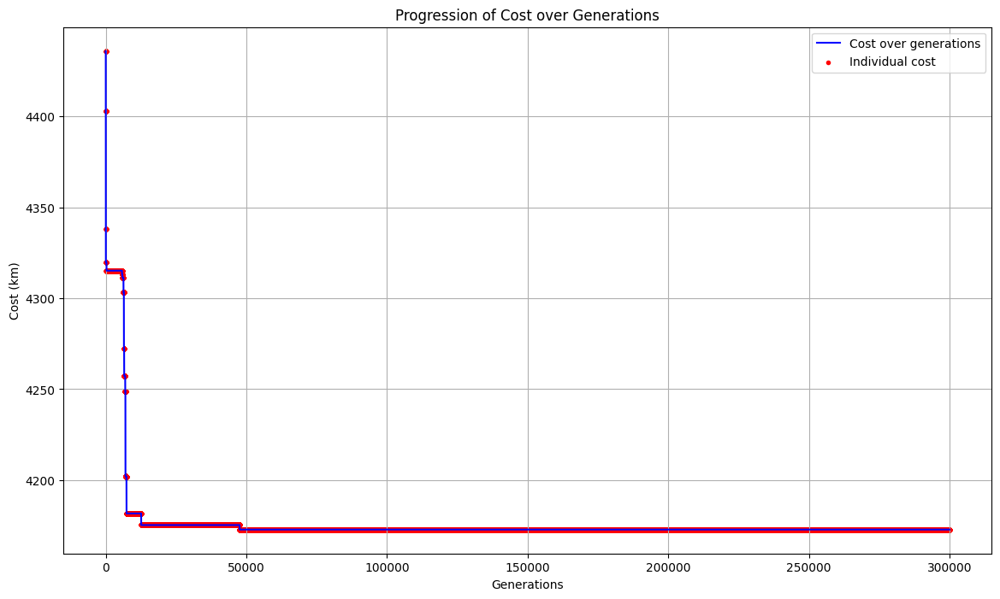

# LAB02 COMPUTATIONAL INTELLIGENCE: TSP

to solve the traveling salesman problem (TSP), I have implemented a solution using a GENETIC ALGORITHM combined with Simulated anneling. 
below are the results obtained using the following parameters:
- population size: 100,
- generations: 200, 000
- mutation rate: 0.3
- initial temperature: 10,000.0
- cooling rate: 0.995
- stagnation limit: 5,000
- adaptive incease: 0.1

### VANATU

Final Best Path Cost: 1345.54 km.

### Italy

Final Best Path Cost: 4172.76 km.

### Russia

Final Best Path Cost: 33534.42 km

### USA

Final Best Path Cost: 40728.69 km

Collaborators:
Lampidecchia Sergio s331080 https://github.com/sergiolampidecchia
Carlo di Pantaleo s333106 https://github.com/carlopantax